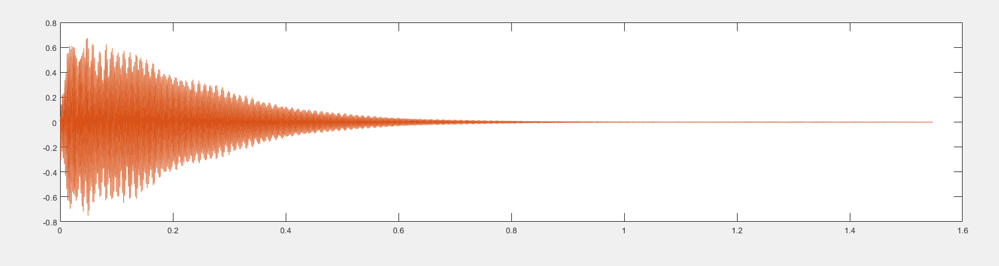
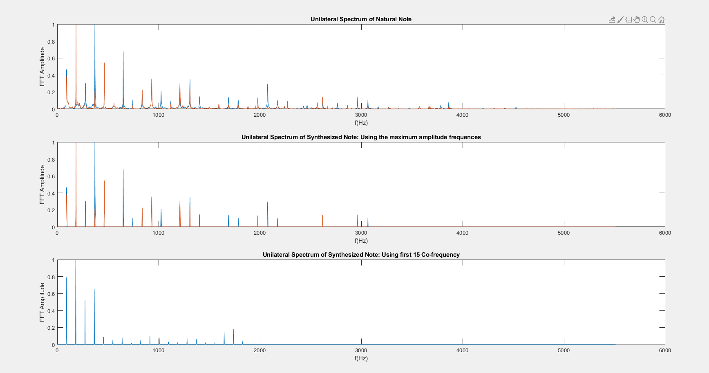
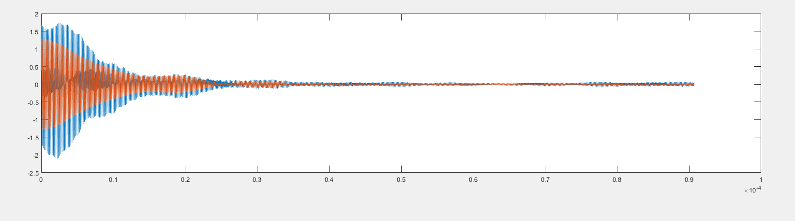
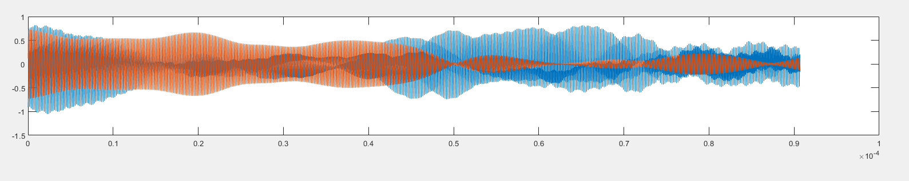
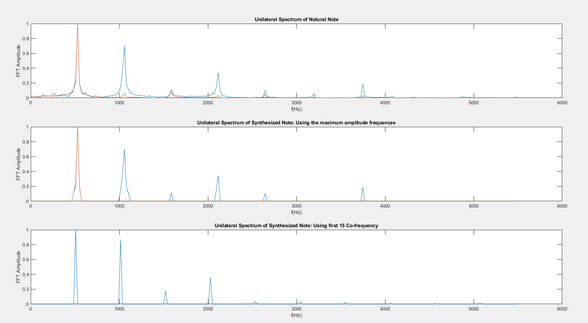
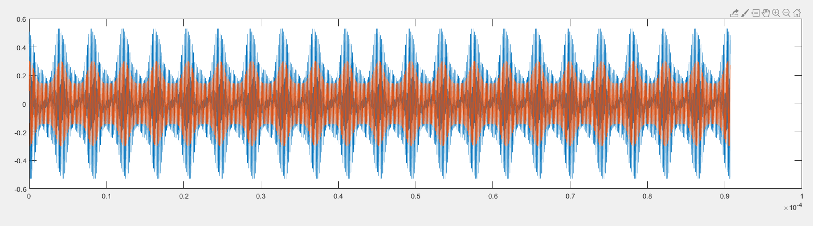
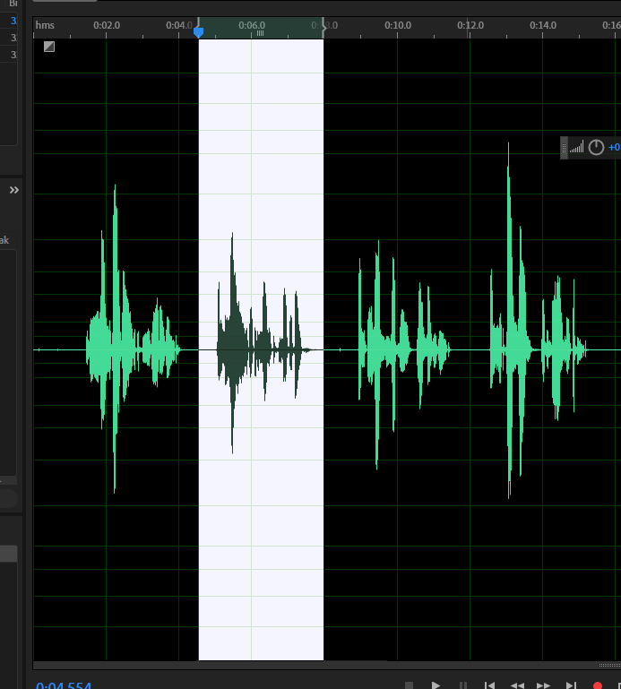
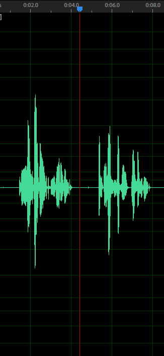
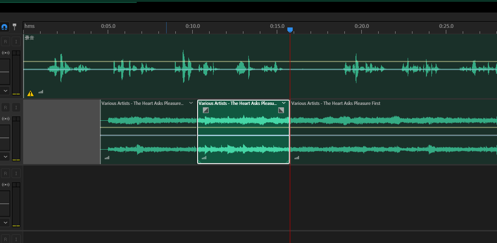
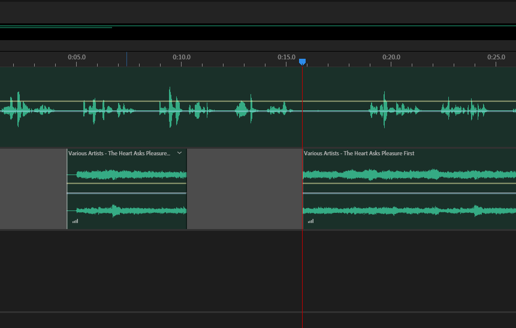

# Electric Organ电子琴

### A Brief Introduction 概述

- 开发时间：2020.1.9

- 语言：python

- 技术栈：basic python + pygame + numpy + pyaudio

#### Functions Implemented 实现功能

- 三种音色：鼓，沙哑的吉他，吉他（拨弦类乐器）
- 基本UI
- pygame下文本框的实现（无pyqt）
- 基本的编曲
- 从tab键到反斜杠键14个音：220hz~540.5hz。涵盖A440。
- 最高支持14 channels，即支持和弦（多声部）
- 播放符合格式的曲子（非MIDI格式）

### Instruction Manual 操作指南

激活虚拟环境（Windows）：`.\venv\Scripts\activate.bat`

运行程序：`python demo.py`

程序会首先合成吉他音。

在第一中模式下按左右方向键可以选择音色，回车确定，程序会自动生成相应音色。生成完毕之后即可使用。按下从 `tab` 到 `\|`即可播放对应频率的单音。

在第二模式下按回车可以播放 `.\scripts` 文件夹下的乐谱。

在第三模式下按回车进入乐谱选择界面。可以选择在 `.\scripts` 文件夹下的乐谱。不需文件后缀。

在第四模式下按回车进入**composer**，正常演奏，会自动生成音符。格式： `{key},{ms_start},{ms_duration}`。同样支持和弦。按下 `ctrl` + `s` 可以试听。用退格等，数字等可以进行编辑。编辑过程中时间轴会暂停。将光标移动到最后按下任意琴键即可自动重启时间轴。按下 `ESC` 键可以不保存退出。

创作完成按下回车。给乐谱命名。

也可以通过直接打开对应 `txt` 格式文件进行编辑。


## Details 技术细节

### TextBox 文本框

> Reference: https://github.com/Nearoo/pygame-text-input

原文本框不能实现多行输入，修改之后可以实现自动换行。详见https://github.com/tctco/electric-organ/blob/master/inputMethod.py

原作者使用的是将字符串一起渲染的方法。这里为了更大利用界面空间，使用了逐字渲染的手段，检测到边界之后换行继续渲染。与pygame的surface实现有关。~~应该说pygame作为游戏框架并不适合做文本框……~~

不支持组合键和输入法。不支持大写输入。与pygame的键盘事件监听实现方法有关。


### Note 音符


#### Music Theory 乐理

钢琴频率采用 **十二平均律** 即在一个八度内的12个键（7白+5黑）频率成等比数列，成八度的键频率翻倍。因此相邻键位的比例系数为：
$$
k = 2^\frac{1}{12}
$$
采用的是 **A440** 为标准音，即认为标准的A音频率为440。在键盘上对应 `]}`键。


#### Music Synthesis 音乐合成


尝试了多种方法。因为对 **信号与系统** 知识的极度匮乏，恶补了大量知识，但也浪费了大量时间。


##### 抽取钢琴音特征的合成手段（失败）



FFT进行频谱分析：



第一张为音源的频谱分析图，第二张为抽取的音源特征频率图，第三张抽取音源基频后利用协频进行合成的分析图。

```matlab
if s_half(i, 1) > LIMIT
    note(:, 1) = note(:, 1) + (s_half(i, 1) .* sin(2 .* pi .* x_half(i) .* t))';
end
if s_half(i, 2) > LIMIT
        note(:, 2) = note(:, 2) + (s_half(i, 2) .* sin(2 .* pi .* x_half(i) .* t))';
end
%两声道分别增加超过一定振幅的组分%
```

**因为不能正确理解FFT的实质，所以一开始直接抽取音源的特征进行合成是错误的。这个过程更接近降噪。FFT同样会抽取出导致振幅渐弱的组分。**



可以发现得到的结果**依然是渐弱的**（未调整两声道振幅比例）。

给每个分量加上一个随机相位可以缓解这种问题，但是依然不靠谱。



而利用协频直接合成效果不佳，原因是很难找到协频前的比例系数。


##### 截取很小一段不断重复（失败）

为了消除渐弱的影响，截取振幅相对稳定的一段不断重复，近似认为振幅不变，可以得到稳定的乐音。但实际上这是很难做到的。使用AU人工编辑效果不理想。

而从源音中抽取一小段做FFT（~~没有归一化频率……还无法完全掌握FFT和matlab……~~）：



噪声比例明显上升。

最后合成的结果：



可以听到一段一段颤抖的声音，完全无法使用。肉眼可见的频率过低。也许进一步缩小取样区间可以实现。


##### 算法合成拨弦类乐器音（目前采用的方法）

> Reference:https://zhuanlan.zhihu.com/p/92577332

**Karplus-Strong algorithm**

模拟真实世界中拨弦类乐音产生的过程。先随机生成一段振幅大的噪声，然后再不断重复这段噪声，同时不断进行采样点之间求平均的操作。初始噪声的形成类似拨弦时“冲激”的效果，噪声段的不断快速重复又形成了频率。求平均的过程不断削弱高频成分，也改变低频成分，最终效果非常接近真实弹拨乐器。

由于纯靠算法实现，可以任意修改其各种参数，从而获得不同衰减速度，模拟出敲鼓或者弹拨乐器乐音。

**两种解决方案**：

1. 即时演算：分配一个线程不断计算生成采样值，创建另一个线程不断读取。只要写入速度比读入速度快就可实现。但实际操作中发现一按键盘CPU就一个核心满载，按键速度稍快就大量卡顿甚至报错。也不支持和弦（multi-channel），遂放弃。
2. 生成足够长的音，在程序其它部分进行控制：与下载自然音源储存起来的方法没有很大区别。但是由于所有音符都是程序自动合成的，后期扩展性较强，而且可以有多种音色的变化。


### Music Score 有关乐谱

~~没有采用标准的MIDI文件，是想自己写尽可能构造所有东西~~

采用 `{key}，{ms_start}，{ms_duration}` 的格式。第一个参数标记音符，第二个参数标记在时间轴上的起始时间，第三个标记音符的持续时间。

引入时间轴而不使用音符之间的相对关系的好处在于：

- 避免休止符
- 和弦的实现较为方便：每一个Note类的对象可以分配一个线程和一个channel进行播放，播放完之后自动回收。

比较麻烦的在于后续要实现的删除音符操作：如果删除音符以插入时间相等的休止符可以选择直接删除。但是如果要求其后所有音符顺次向时间轴前挪动代价就比较大。

按一般音频编辑器逻辑，在多声部的情况下，引入时间轴较明智。只有一个声部则采用相对时间较好。





单声部情况下删除对应部分后会自动拼接。





多轨情况下删除一节，后部不会自动拼接。


### Difficulties 目前遇到的技术难点

1. 多线程
2. 面向对象编程
3. 程序设计
4. 音频合成
5. 乐理和频谱分析
